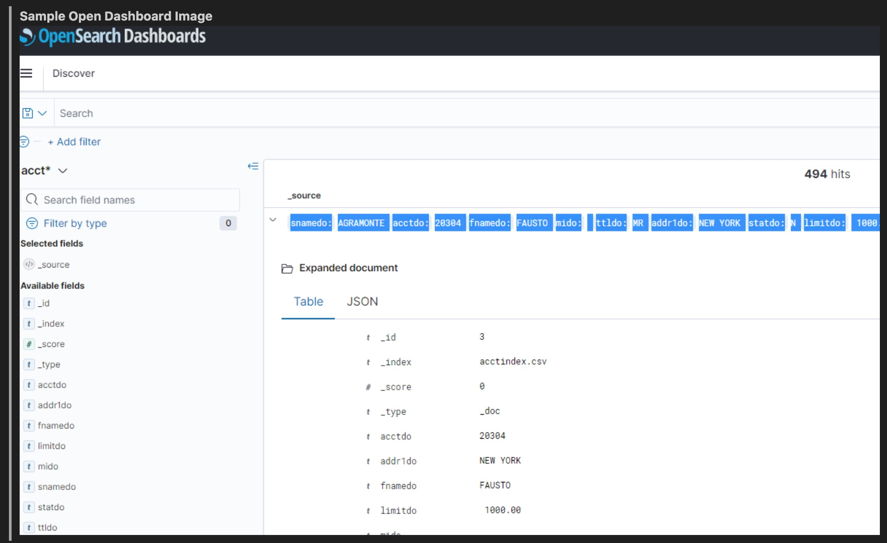
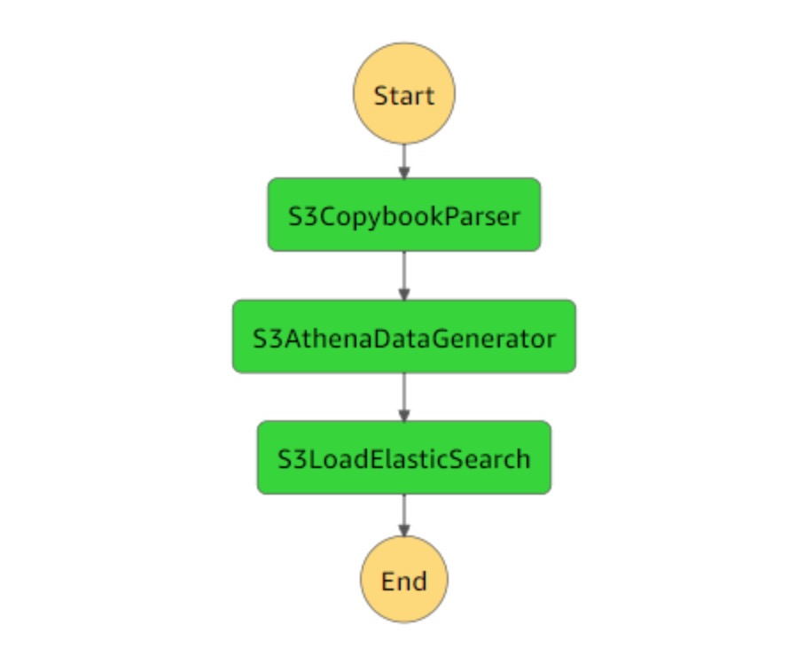

## Advanced Mainframe File Viewer

### [View all Roadmaps](https://github.com/nholuongut/all-roadmaps) &nbsp;&middot;&nbsp; [Best Practices](https://github.com/nholuongut/all-roadmaps/blob/main/public/best-practices/) &nbsp;&middot;&nbsp; [Questions](https://www.linkedin.com/in/nholuong/)
 

File-AID is a widely used mainframe data management tool for browsing, viewing and editing files in table and column formats using metadata layouts (copybooks). A copybook is a section of COBOL code that defines data structures of a program. It holds metadata information (column name, size, type etc..) about a data file.

There are different patterns using which customers migrate and modernize their mainframe workloads to run on AWS. Many times, customers chose to retain the same mainframe file structure and layout for consistency while modernizing their workloads. A typical example is, batch applications transmitting files to external parties (with a specific file layout) and the same file layout needs to be retained for consistency even after the migration to AWS. Customers have been asking for an AWS solution that can help them browse and review files. The solution is expected to enable faster development and testing during the migration and support maintenance activities post the migration.

## Security

See [CONTRIBUTING](CONTRIBUTING.md#security-issue-notifications) for more information.

## License

This library is licensed under the MIT-0 License. See the LICENSE file.

****Sample Open Dashboard Image****

****Sample Statemachine Flow******

# 🚀 I'm are always open to your feedback.  Please contact as bellow information:
### [Contact ]
* [Name: nho Luong]
* [Skype](luongutnho_skype)
* [Github](https://github.com/nholuongut/)
* [Linkedin](https://www.linkedin.com/in/nholuong/)
* [Email Address](luongutnho@hotmail.com)

# License
* Nho Luong (c). All Rights Reserved.🌟